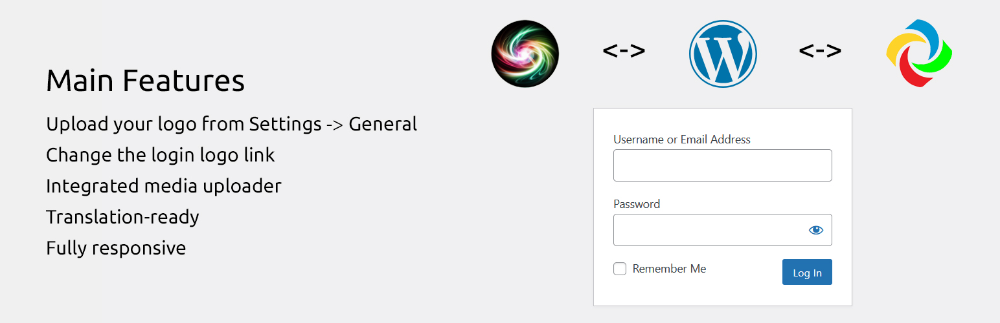
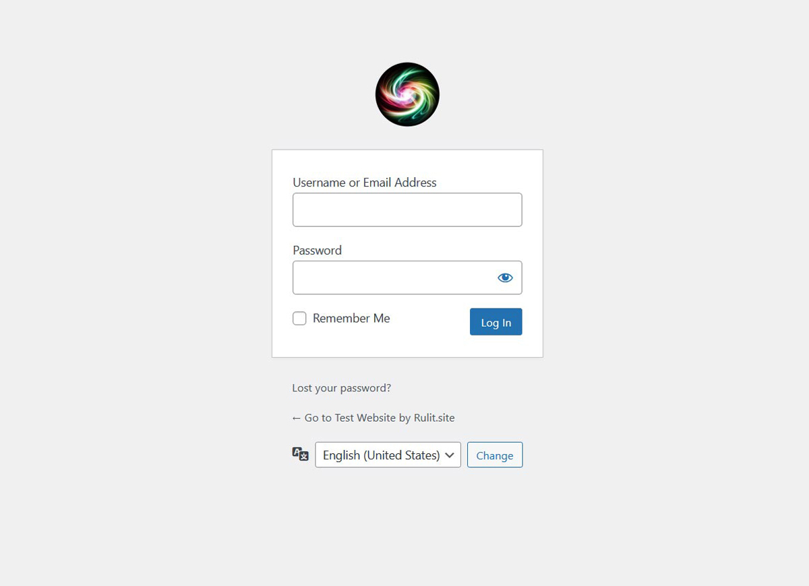
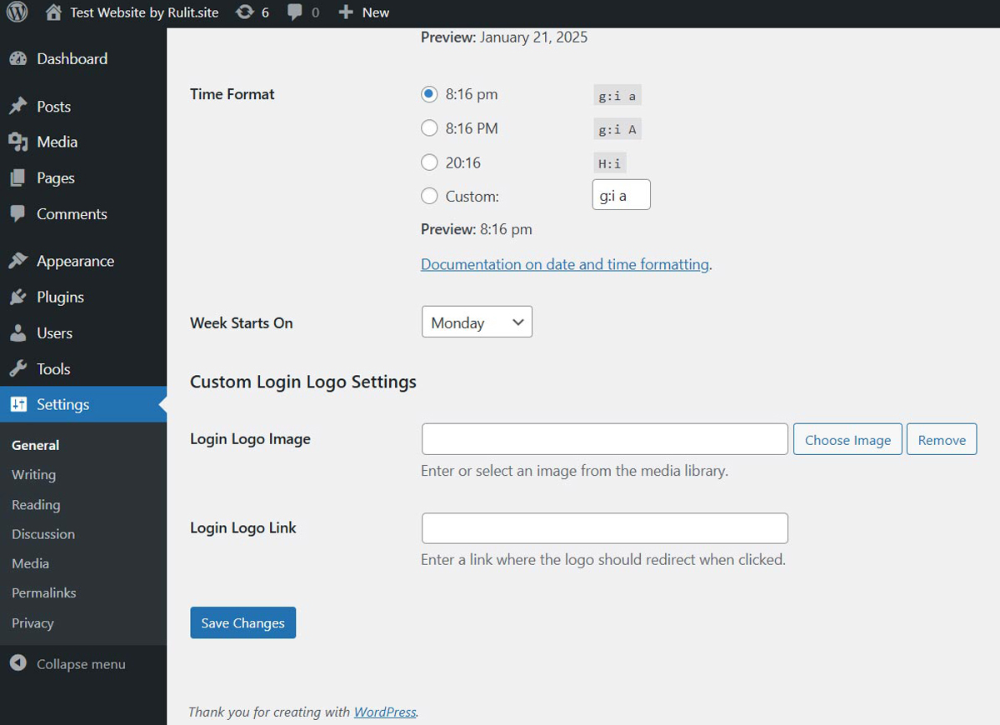

# Custom Image Login Logo

Customize the WordPress login page by adding a custom logo, changing the link, and ensuring full responsiveness.

## 📦 Download

🔗 **[WordPress Plugin Directory](https://wordpress.org/plugins/custom-image-login-logo/)**

## 🎨 Features

✅ Upload your logo from **Settings → General**  
✅ Change the login **logo link**  
✅ Fully responsive on mobile and tablet  
✅ **Translation-ready**  
✅ **If no custom or theme logo is selected, the default WordPress logo is displayed**  
✅ **Integrated media uploader** – select images directly from the Media Library  
✅ **cill-admin.js** – enhances media uploader functionality for better user experience  

## 🛠 Installation

### 1️⃣ Install via WordPress Admin
1. Go to **Plugins > Add New**
2. Search for `Custom Image Login Logo`
3. Click **Install Now** and **Activate**

### 2️⃣ Manual Installation
1. Download the `.zip` file
2. Go to **Plugins > Add New > Upload Plugin**
3. Select the `.zip` file and install it

### 3️⃣ FTP Installation
1. Extract the `.zip` file
2. Upload the `custom-image-login-logo` folder to `/wp-content/plugins/`
3. Activate the plugin via **Plugins** menu

## 🚀 Usage

1. **Upload your logo:**
   - Navigate to **Settings > General**
   - Enter or select an image URL from the **Media Library**

2. **Customize login page settings:**
   - Set the **login logo link** (default: homepage)

3. **Fallback to default WordPress logo:**
   - If no **custom** or **theme** logo is selected, the default **WordPress logo** will be used

4. **Use Media Library for logo selection:**
   - `cill-admin.js` enables smooth integration with WordPress media uploader
   - Supports selecting, previewing, and removing images easily

## 📸 Screenshots

### 1️⃣ Custom login page

### 2️⃣ Admin settings

## ❓ FAQ

### How do I restore the default WordPress logo?
Simply deactivate the plugin.

### Is this plugin compatible with multisite?
Yes, it works with WordPress Multisite.

### Does the plugin support translations?
Yes! The plugin is fully translation-ready.

## 📌 Changelog

### 1.4
- Optimized CSS loading
- Improved theme logo detection
- Enhanced security for stored settings
- Integrated `cill-admin.js` for improved media uploader functionality
- If no custom or theme logo is selected, the default WordPress logo is displayed

### 1.3
- Added admin settings to upload a custom logo
- Added options to change login logo link
- Improved mobile responsiveness
- Made plugin fully translation-ready

### 1.2
- Improved security with `esc_attr__()`
- Enhanced CSS for better logo alignment
- Tested with WordPress 6.7.1

### 1.1
- Added support for `custom_logo` from theme settings
- Improved responsive behavior

### 1.0
- Initial release

## 📝 License

This plugin is licensed under **GPL-2.0+**. See the full license here: [GNU GPL v2.0](https://www.gnu.org/licenses/gpl-2.0.html).

## 👤 Author

**Volodymyr Hannibal**  
🌍 [Visit Developer's Website](https://rulit.site)  

If you find this plugin useful, please leave a ⭐⭐⭐⭐⭐ rating!

